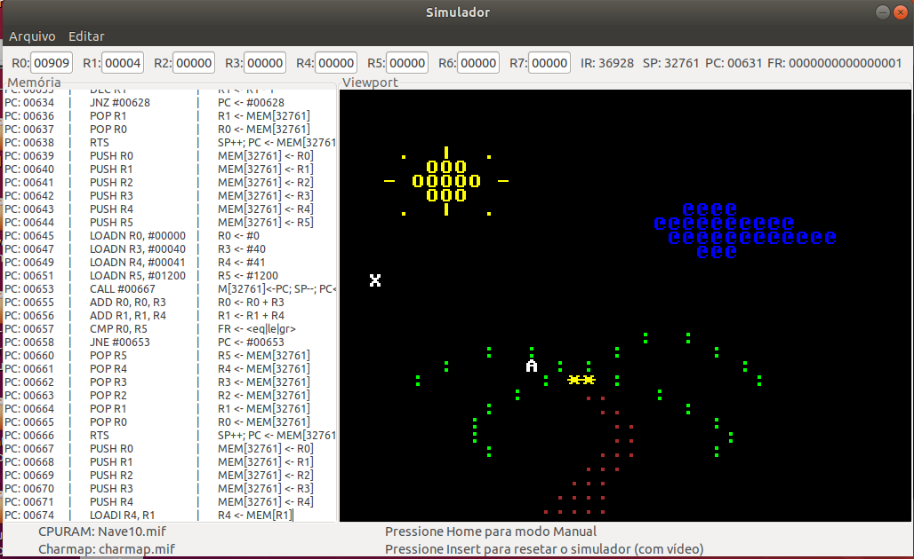

# SpaceShip

OVERVIEW
--------------------------------------------------
The purpose of this project was to implement a retro game in ICMC Assembly for the [Computer Organization and Architecture] course. ICMC Assembly is a simplified assembly implementation for academic purposes. It was made at the Computer Science undergraduate program from University of São Paulo (ICMC - USP).



HOW TO PLAY
--------------------------------------------------
Your spaceship is the 'X' character and the enemy is the 'A' which moves around the screen all the time, you have to try and shoot it.

* W: up
* S: down
* A: left
* D: right
* SPACE BAR: shoot missile

HOW TO ASSEMBLE AND RUN
--------------------------------------------------
This guide is for Linux.
To run the assembler and the simulator you have to install the dependencies bellow:

```bash
	1. sudo su
	2. apt install libcanberra-gtk-module libcanberra-gtk3-module
	3. apt-get install libgtk2.0-dev
	4. apt-get install libncurses5-dev
```

Installing the Assembler:
```bash
	1. Extract the Assembler folder.
	2. Using the terminal, go to the Assembler folder (montador_fonte) and compile it through the command `gcc *.c -o assembler`
	3. Copy the assembler executable file to a folder of your preference.
```

Installing the Simulator:
```bash
	1. Extract the simulator folder.
	2. Using the terminal, go to the Simulator folder (simulador_fonte) and compile it through the command `sh compila.sh`
	3. Copy the simulator executable file to a folder of your preference.
```

Assembling and Running the Game:
```bash
	1. ./assembler spaceship.asm spaceship.mif
	This is going to generate a .mif file

	2. ./sim spaceship.mif charmap.mif
	Note: The charmap.mif file is included in this repository, you need to extract it.
	
	3. After opening the simulator window, press HOME key to start.
```
